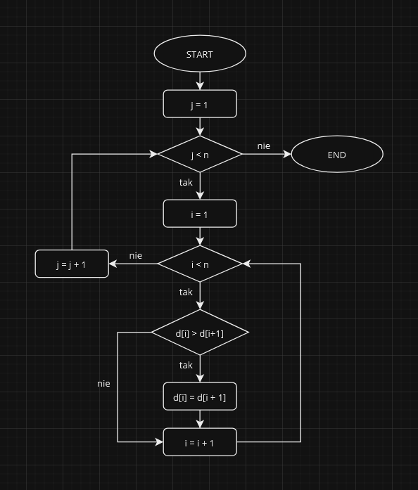

# Sortowanie Bąbelkowe

**Sortowanie bąbelkowe** jest jednym z **najprostszych** algorytmów sortujących. Polega ono na porównywaniu kolejnych elementów zbioru i zamienianiu ich miejscami, jeśli są w niewłaściwej kolejności.

Animacja pokazująca działanie **sortowania babelkowego**:

## Cechy

### Złożoność Czasowa
**Złożoność czasowa** sortowania bąbelkowego wynosi \\( O(n^2) \\), gdzie \\( n \\) jest liczbą elementów w zbiorze. Oznacza to, że czas wykonania algorytmu **rośnie kwadratowo wraz ze wzrostem rozmiaru zbioru**.

### Złożoność Pamięciowa
**Złożoność pamięciowa** sortowania bąbelkowego wynosi \\( O(1) \\). Oznacza to, że algorytm jest działającym **w miejscu** czyli **nie wymaga dodatkowej pamięci** poza pamięcią wymaganą do przechowywania danych wejściowych.

### Stabilność
**Sortowanie bąbelkowe** jest **niestabilnym** algorytmem sortującym. Oznacza to, że kolejność elementów o równej wartości **może zostać zaburzona**.

## Sposób Działania
**Sortowanie bąbelkowe** działa w następujący sposób:
1. **przekazanie danych** - pierwszym krokiem algorytmu jest przekazanie danych do sortowania. W przypadku sortowania bąbelkowego dane mogą być reprezentowane przez dowolną strukturę danych, która umożliwia dostęp do kolejnych elementów na przykład tablica.
2. **inicjowanie zmiennych** - kolejnym krokiem jest zainicjowanie zmiennych, które będą używane przez algorytm. W tym przypadku będziemy potrzebować zmiennej \\( i \\), która będzie przechowywać indeks bieżącego elementu w zbiorze, oraz zmiennej \\( j \\), która będzie przechowywać indeks następnego elementu w zbiorze.
3. **cykl zewnętrzny** - cykl zewnętrzny algorytmu będzie wykonywać się \\( n-1 \\) razy, gdzie \\( n \\) jest liczbą elementów w zbiorze. W każdym przejściu cyklu zewnętrznego algorytm będzie przechodzić przez zbiór od początku do końca, porównując kolejne elementy.
4. **cykl wewnętrzny** - cykl wewnętrzny algorytmu będzie wykonywać się \\( n-i-1 \\) razy, gdzie \\( i \\) jest numerem bieżącego przejścia cyklu zewnętrznego. W każdym przejściu cyklu wewnętrznego algorytm będzie porównywać elementy \\( i \\) i \\( i+1 \\) w zbiorze.
5. **przeniesienie elementów** - jeśli elementy \\( i \\) i  \\( i+1 \\) są w niewłaściwej kolejności, algorytm zamieni je miejscami.
6. **koniec cyklu**

Gdy cykl wewnętrzny zakończy się, algorytm sprawdzi, czy podczas ostatniego przejścia cyklu doszło do wymiany elementów. Jeśli nie, to zbiór jest posortowany i algorytm może **zakończyć działanie**.

Oto **schemat blokowy** przedstawiający sposób działania **sortowania bąbelkowego**:

**Dane wejściowe** dla algorytmu widocznego na schemacie to:
- `d[]` - zbiór liczb do sortowania,
- `n` - długość zbioru `d[]`.

## Podsumowanie
**Sortowanie bąbelkowe** jest prostym i łatwym w implementacji algorytmem sortującym. Jednak jego złożoność czasowa \\( O(n^2) \\) sprawia, że **nie jest ono wydajne w przypadku dużych zbiorów danych**. Sortowanie bąbelkowe **jest podstawą**, każdy programista powinien **znać ten algorytm**.
