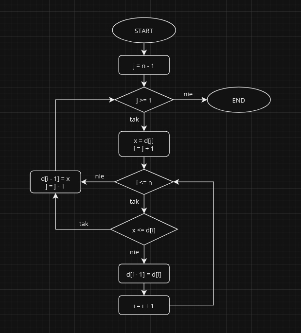

# Sortowanie Przez Wstawianie

**Sortowanie przez wstawianie** to również jeden z **najprostszych** algorytmów sortowania. Działa on poprzez pobieranie kolejnych elementów zbioru nieuporządkowanego i wstawianie ich na odpowiednie miejsce w zbiorze posortowanym.

Animacja pokazująca działanie **sortowania przez wstawianie**:

## Cechy

### Złożoność Czasowa
**Złożoność czasowa** sortowania przez wstawianie wynosi \\( O(n^2) \\), gdzie \\( n \\) jest liczbą elementów w zbiorze. Oznacza to, że czas wykonania algorytmu **rośnie kwadratowo wraz ze wzrostem rozmiaru zbioru**.

### Złożoność Pamięciowa
**Złożoność pamięciowa** sortowania przez wstawianie wynosi \\( O(1) \\). Oznacza to, że algorytm jest działającym **w miejscu** czyli **nie wymaga dodatkowej pamięci** poza pamięcią wymaganą do przechowywania danych wejściowych.

### Stabilność
**Sortowanie przez wstawianie** jest **stabilnym** algorytmem sortującym. Oznacza to, że kolejność elementów o równej wartości **nie zostanie zaburzona**.

## Sposób Działania
**Sortowanie przez wstawianie** jest algorytmem sortującym, który działa w następujący sposób:
1. **przekazanie danych** - pierwszym krokiem algorytmu jest przekazanie danych do sortowania. W przypadku sortowania przez wstawianie dane mogą być reprezentowane przez dowolną strukturę danych, która umożliwia dostęp do kolejnych elementów na przykład tablica.
2. **inicjowanie zmiennych** - kolejnym krokiem jest zainicjowanie zmiennych, które będą używane przez algorytm. W tym przypadku będziemy potrzebować zmiennej \\( i \\), która będzie przechowywać indeks bieżącego elementu w zbiorze.
3. **cykl zewnętrzny** - cykl zewnętrzny algorytmu będzie wykonywać się od \\( 1 \\) do \\( n \\), gdzie \\( n \\) jest liczbą elementów w zbiorze. W każdym przejściu cyklu zewnętrznego algorytm będzie porównywać bieżący element ze wszystkimi elementami, które są przed nim w zbiorze.
4. **cykl wewnętrzny** - cykl wewnętrzny algorytmu będzie wykonywać się od \\( 0 \\) do \\( i-1 \\). W każdym przejściu cyklu wewnętrznego algorytm będzie porównywać bieżący element ze wszystkimi elementami, które są przed nim w zbiorze.
5. **przeniesienie elementów** - jeśli bieżący element jest mniejszy niż element o indeksie \\( j \\), algorytm zamieni je miejscami.
6. **koniec cyklu** - gdy cykl zewnętrzny zakończy się, zbiór będzie posortowany.

Oto **schemat blokowy** przedstawiający sposób działania **sortowania przez wstawianie**:

**Dane wejściowe** dla algorytmu widocznego na schemacie to:
- `d[]` - zbiór liczb do sortowania,
- `n` - długość zbioru `d[]`.

## Podsumowanie
**Sortowanie przez wstawianie** jest algorytmem sortującym, który jest **stabilny** i **działa w miejscu**. Jednak jego złożoność czasowa rzędu \\( O(n^2) \\) sprawia, że **nie jest ono wydajne w przypadku dużych zbiorów danych**.
