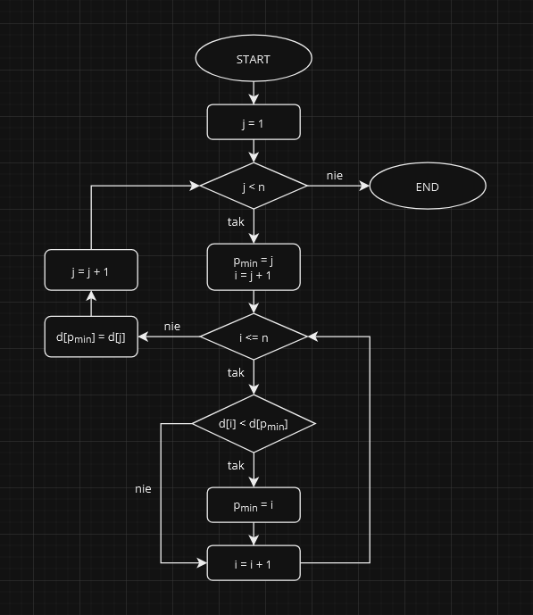

# Sortowanie Przez Wybór

**Sortowanie przez wybór** to algorytm sortowania, który działa poprzez wyszukiwanie elementu o najmniejszej wartości w zbiorze nieuporządkowanym i umieszczanie go na początku zbioru posortowanego. Następnie algorytm powtarza tę operację dla pozostałej części zbioru nieuporządkowanego, aż cały zbiór będzie posortowany.

Animacja pokazująca działanie **sortowania przez wybór**:

## Cechy

### Złożoność Czasowa
**Złożoność czasowa** sortowania przez wybór wynosi \\( O(n^2) \\), gdzie \\( n \\) jest liczbą elementów w zbiorze. Oznacza to, że czas wykonania algorytmu **rośnie kwadratowo wraz ze wzrostem rozmiaru zbioru**.

### Złożoność Pamięciowa
**Złożoność pamięciowa** sortowania przez wybór wynosi \\( O(1) \\). Oznacza to, że algorytm **nie wymaga dodatkowej pamięci** poza pamięcią wymaganą do przechowywania danych wejściowych.

### Stabilność
**Sortowanie przez wybór** jest **niestabilnym** algorytmem sortującym. Oznacza to, że kolejność elementów o równej wartości **może zostać zaburzona**.

## Sposób Działania
**Sortowanie przez wybór** jest algorytmem sortującym, który działa w następujący sposób:
1. **przekazanie danych** - pierwszym krokiem algorytmu jest przekazanie danych do sortowania. W przypadku sortowania przez wybór dane mogą być reprezentowane przez dowolną strukturę danych, która umożliwia dostęp do kolejnych elementów na przykład tablica.
2. **inicjowanie zmiennych** - kolejnym krokiem jest zainicjowanie zmiennych, które będą używane przez algorytm. W tym przypadku będziemy potrzebować zmiennej \\( min \\), która będzie przechowywać indeks najmniejszego elementu w zbiorze.
3. **cykl zewnętrzny** - cykl zewnętrzny algorytmu będzie wykonywać się od \\( 0 \\) do \\( n-1 \\), gdzie \\( n \\) jest liczbą elementów w zbiorze. W każdym przejściu cyklu zewnętrznego algorytm będzie znajdował najmniejszy element w zbiorze od indeksu \\( i \\) do końca zbioru.
4. **przeniesienie elementów** - jeśli bieżący element jest mniejszy niż najmniejszy element w zbiorze, algorytm zamieni je miejscami.
5. **koniec cyklu** - gdy cykl zewnętrzny zakończy się, zbiór będzie posortowany.

Oto **schemat blokowy** przedstawiający sposób działania **sortowania przez wybór**:

**Dane wejściowe** dla algorytmu widocznego na schemacie to:
- `d[]` - zbiór liczb do sortowania,
- `n` - długość zbioru `d[]`.

## Podsumowanie
**Sortowanie przez wybór** jest algorytmem sortującym, który jest **niestabilny** i **działa w miejscu**. Jednak jego złożoność czasowa rzędu \\( O(n^2) \\) sprawia, że **nie jest ono wydajne w przypadku dużych zbiorów danych**.
