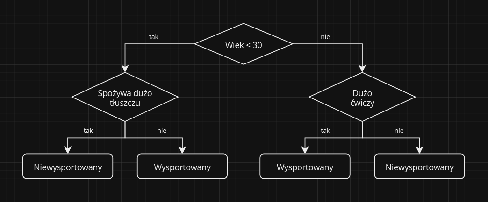

# Drzewo Decyzyjne

**Drzewo decyzyjne** to metoda [**projektowania algorytmu**](index.html) która polega na **tworzeniu struktury danych**, która przedstawia proces podejmowania decyzji **w postaci drzewa**. Drzewo decyzyjne składa się z **węzłów i krawędzi**. Węzły reprezentują decyzje, które należy podjąć, a krawędzie reprezentują możliwe wybory.

## Sposób Działania
**Drzewo decyzyjne** działa w następujących etapach:
1. **rozpoczyna się** w korzeniu drzewa.
2. **wybiera** jedną z krawędzi wychodzących z węzła, w którym się znajduje.
3. **przechodzi** do węzła, do którego prowadzi wybrana krawędź.
4. **powtarza kroki 2 i 3**, dopóki nie dotrze do liścia drzewa.
5. **wykonuje** akcję, która jest powiązana z docelowym liściem drzewa.

## Zalety
**Drzewa decyzyjne** mają następujące zalety:
- są **łatwe do zrozumienia i implementacji**,
- mogą być używane do rozwiązywania problemów o **złożonych zależnościach**,
- mogą być używane do **podejmowania decyzji w czasie rzeczywistym**.

## Wady
Drzewa decyzyjne mają też swoje wady:
- mogą **nie działać prawidłowo**, jeśli dane wejściowe są niepewne,
- mogą być **nieefektywne**, jeśli drzewo jest zbyt duże.

## Przykład Zastosowania
Przykładem zastosowania metody **drzewa decyzyjnego** może być **algorytm decydujący czy osoba jest wysportowana**.

Algorytm ten zaprojektowany używając **drzewa decyzyjnego** będzie wyglądał w następujący sposób:

## Podsumowanie
**Drzewa decyzyjne** to potężne narzędzie, które może być używane do **rozwiązywania problemów o złożonych zależnościach**. Mogą być używane nie tylko w informatyce ale w różnych dziedzinach, takich jak przykładowo medycyna, finanse, marketing i zarządzanie.
