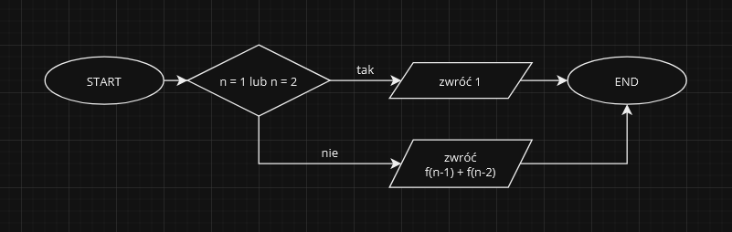

# Rekurencja

**Rekurencja** to sposób definiowania lub rozwiązywania problemu poprzez **odniesienie do samego siebie**. Rekurencja w programowaniu to technika, w której **funkcja wywołuje sama siebie**. Jest to **bardzo potężna technika**, która jest wykorzystywana do rozwiązywania wielu [**problemów algorytmicznych**](index.html).

<iframe width="560" height="315" style="border: 1px solid rgb(49, 49, 49); border-radius: 20px;" src="https://www.youtube-nocookie.com/embed/rf60MejMz3E?si=85jHc0T_51HMldzL" title="YouTube video player" frameborder="0" allow="accelerometer; autoplay; clipboard-write; encrypted-media; gyroscope; picture-in-picture; web-share" allowfullscreen></iframe>

## Zasady
**Algorytm rekurencyjny** powinien spełniać następujące zasady:
- **warunek zakończenia** - ciąg wywołań rekurencyjnych musi się kiedyś zakończyć. W przeciwnym razie algorytm nie zakończy się nigdy.
- **zmiana danych** - każde wywołanie rekurencyjne powinno modyfikować dane wejściowe w taki sposób, aby zbliżały się one do rozwiązania problemu.
- **powtórzenie** - ciąg wywołań rekurencyjnych powinien powtarzać się, aż do momentu spełnienia warunku zakończenia.

## Zalety
**Rekurencja** ma następujące zalety:
- może być **używana do rozwiązywania problemów, które trudno lub niemożliwie jest rozwiązać bez użycia rekurencji**,
- może być **bardziej elegancka i czytelna** niż odpowiednik iteracyjny.

## Wady
**Rekurencja** ma również następujące wady:
- może być **trudna** do zrozumienia i zaimplementowania,
- może prowadzić do **problemów z pamięcią**, jeśli ciąg wywołań rekurencyjnych jest zbyt głęboki.

## Przykład
Algorytmem który ma wariant rekurencyjny jest **algorytm obliczania ciągu Fibonacciego**. Oto ten algorytm w [schemacie blokowym](pa/sb.md):

W algorytmietym  zakładamy, że argument `n` na wejściu jest **numerem wyrazu ciągu**, który chcemy otrzymać w wyniku.

## Podsumowanie
**Rekurencja** jest potężną techniką, która jest wykorzystywana do **rozwiązywania wielu problemów algorytmicznych**. Jednakże należy pamiętać o jej **zaletach i wadach**, aby móc ją wykorzystywać w sposób efektywny.
