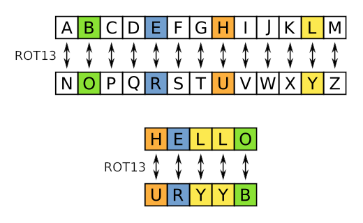

# Szyfr Cezara (ROT-13)

**Szyfr Cezara** czyli **ROT-13** jest jednym z **najprostszych i najstarszych** [algorytmów](index.html) szyfrujących. Polega on na zastąpieniu każdej litery tekstu jawnego literą, która znajduje się w alfabecie o **określoną liczbę pozycji dalej**.

## Cechy

### Złożoność Czasowa
**Złożoność czasowa** szyfru Cezara wynosi rzędu \\( O(n) \\), gdzie \\( n \\) jest długością tekstu. Oznacza to, że **czas wykonania szyfrowania lub odszyfrowywania tekstu jest proporcjonalny do długości tekstu**.

### Złożoność Pamięciowa
**Złożoność pamięciowa** szyfru Cezara wynosi rzędu \\( O(1) \\). Oznacza to, że algorytm **nie wymaga dodatkowej pamięci** poza pamięcią wymaganą do przechowywania klucza szyfru.

### Stabilność
**Szyfr Cezara** jest **niestabilnym** szyfrem. Oznacza to, że kolejność liter o równej wartości **może zostać zaburzona**.

## Sposób Działania
Algorytm **ROT-13** działa w następujący sposób:
1. **przejdź** przez cały tekst jawny, litera po literze.
2. dla każdej litery:
    - **odszukaj** literę w alfabecie, która jest przesunięta na przykład o 13 pozycji w prawo,
    - **zastąp** oryginalną literę znalezioną literą.

## Podsumowanie
<iframe width="560" height="315" style="border: 1px solid rgb(49, 49, 49); border-radius: 20px;" src="https://www.youtube-nocookie.com/embed/JO3taR0xa5Q?si=BaeSghOOiTRLv9dP" title="YouTube video player" frameborder="0" allow="accelerometer; autoplay; clipboard-write; encrypted-media; gyroscope; picture-in-picture; web-share" allowfullscreen></iframe>

**Szyfr Cezara** jest prostym i łatwym w implementacji szyfrem. Jest on jednak **stosunkowo mało bezpieczny** oraz **bardzo łatwy do złamania**, ponieważ można go złamać metodą prób i błędów.
