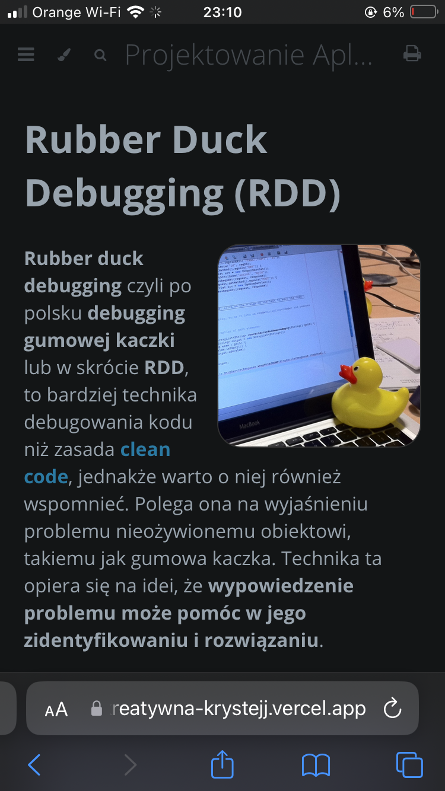

# Wstęp

W tej pracy przedstawię **wiele pojęć i zasad** związanych z programowaniem oraz informatyką. Omówione zostaną następujące tematy:
1. [**Zasady Clean Code**](zcc/index.html) - zasady tworzenia kodu, który jest czytelny oraz łatwy w utrzymaniu.
2. [**Zasady Programowania Obiektowego**](zpo/index.html) - zasady tworzenia wysokiej jakości programów obiektowych.
3. [**Dokumentowanie Kodu**](dk.md) - sposób opisywania kodu w celu ułatwienia jego zrozumienia i utrzymania.
4. [**Algorytm**](algorytm/index.html) - zestaw instrukcji, które określają sposób rozwiązania problemu.
5. [**Projektowanie Klas**](pk/index.html) - sposób tworzenia obiektów, które są ze sobą powiązane w logiczny sposób.

W całej pracy obecne są **przykłady kodu, schematy, diagramy, tabele porównujące, zdjęcia, animacje oraz filmy**.

Strona posiada **funkcje wyszukiwania** oraz **różne motywy** dostępne u góry strony.

Jest również **przystosowana do działania z urządzeniami mobilnymi**. Polecam sprawdzić, ale tak na wypadek gdyby Panu się nie chciało i tak dam screena, żeby to udowodnić.

**Miłego czytania!** 😽
