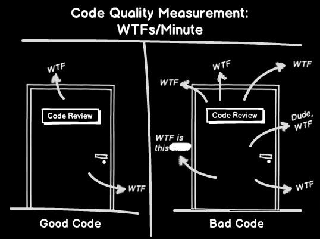

# Zasady Clean Code

**Zasady clean code** lub po prostu **czysty kod**, to zasady oraz wytyczne, dotyczące pisania kodu, który jest **łatwy do zrozumienia, utrzymania i modyfikacji**. Kładą nacisk na **prostotę, czytelność i klarowność**, dążąc do stworzenia kodu, który jest **samowystarczalny i minimalizuje ryzyko błędów**.

> "Każdy głupiec może napisać kod zrozumiały dla komputera. Dobrzy programiści piszą kod zrozumiały **dla ludzi**." – [Martin Fowler](https://en.wikipedia.org/wiki/Martin_Fowler_(software_engineer))

## Cel
Dzięki stosowaniu zasad **clean code**, tworzymy kod który jest:
- **klarowny i czytelny** - taki kod jest łatwy do zrozumienia dla innych programistów, którzy mogą w przyszłości z nim pracować.
- **efektywny** - jest wydajny i używa jak najmniejszej ilości zasobów systemowych, aby nie obciążać sprzętu oraz aby mógłby być używany w bardziej ekstremalnych warunkach sprzętowych.
- **testowalny** - powinien być łatwy do testowania, aby można było zapewnić jego poprawne, przewidziane oraz zaplanowanie działanie.
- **utrzymywalny** - łatwy do modyfikowania i rozszerzania, aby można było go bez trudu aktualizować, ulepszać, wzbogacać o nowe funkcje oraz dostosowywać do zmieniających się wymagań.

## Podstawowe Zasady
Najbardziej kluczowe zasady **clean code** to:
- [**Keep it simple, stupid!**](kiss.md) - pisz prosty, nie skomplikowany kod.
- [**Don't repeat yourself**](dry.md) - unikaj powtórzeń.
- [**You ain't gonna need it**](yagni.md) - nie pisz kodu, którego nie potrzebujesz w aktualnym momencie.
- [**Stick to naming conventions**](stnc.md) - stosuj się do konwencji nazewniczych języka.
- [**Fail fast**](ff.md) - gdy wystąpi problem, zakończ natychmiast.
- [**Code as documentation**](cas.md) - pisz kod który jest czytelny i tłumaczy sam siebie.
- [**Read the fricking manual**](rtfm.md) - jeśli masz pytanie, sprawdź dokumentacje oraz internet przed zadaniem go.
- [**Test-driven development**](tdd.md) - na bierząco testuj swój kod.
- [**Rubber duck debugging**](rdd.md) - zasada pomagająca w debugowaniu kodu.

## Podsumowanie

Pisanie czytego kodu **wymaga czasu i praktyki** lecz **każdy programista powinien znać te zasady i stosować je w swojej pracy**. Dzięki temu będzie mógł pisać kod, który jest **wysokiej jakości, łatwy w utrzymaniu i modyfikowaniu oraz bezproblemowo czytelny dla innych**.
