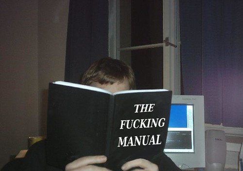

# Read The Fucking Manual (RTFM)

**Read the fucking manual** czyli po polsku **przeczytaj cholerną instrukcję** lub w skrócie **RTFM** to zasada, która bardziej dotyczy nauki i znajdywania odpowiedzi na pytania niż pisania kodu. Mówi ona, że **przed zadaniem pytania, należy najpierw sprawdzić, czy odpowiedź nie jest dostępna w dokumentacji**. Oczywiście, nie zawsze można znaleźć odpowiedź w dokumentacji. W takich przypadkach należy zadać pytanie, ale **najpierw należy sprawdzić, czy pytanie nie zostało już zadane i czy odpowiedź nie jest dostępna w internecie**. Zasada ta może być również stosowana w innych dziedzinach niż informatyka. 

> RTFM jest również slangiem, często używanym na forach internetowych.

Oto **bardzo rzadko spotykany** okaz osoby czytającej *cholerną instrukcję*.

## Zalety
**RTFM** ma kilka zalet:
- **oszczędza czas** - zamiast czekać na odpowiedź od drugiej osoby, można samodzielnie znaleźć odpowiedź w dokumentacji. W ten sposób oszczędzamy czas swój, ale również innych osób, które próbowałyby nam pomóc z znalezieniem odpowiedzi.
- **pomaga w nauce** - czytanie dokumentacji może pomóc w zrozumieniu działania danego produktu lub usługi.
- **poprawia wydajność** - jeśli wszyscy pracownicy stosują tą zasadę, łatwiej jest im się dogadać i współpracować.

## Etapy
**RTFM** powinna być stosowana w następujący sposób:
1. przed zadaniem pytania, należy **najpierw sprawdzić dokumentację** produktu lub usługi, której dotyczy pytanie.
2. jeśli nie można znaleźć odpowiedzi w dokumentacji, **należy sprawdzić, czy pytanie nie zostało już wcześniej zadane**.
3. jeśli pytanie nie zostało jeszcze zadane, można je zadać, ale **należy się upewnić, czy nie jest to pytanie głupie lub dziwne**.

## Podsumowanie
<iframe width="560" height="315" style="border: 1px solid rgb(49, 49, 49); border-radius: 20px;" src="https://www.youtube-nocookie.com/embed/-XqpAvOaYgY?si=z_XFEv_xPVY4vi9k" title="YouTube video player" frameborder="0" allow="accelerometer; autoplay; clipboard-write; encrypted-media; gyroscope; picture-in-picture; web-share" allowfullscreen></iframe>

Ogólnie rzecz biorąc, zasada **RTFM** jest **prostą oraz dobrą zasadą**, która **pomaga w oszczędzaniu czasu, poprawie wydajności i nauce**. Znacząco pomoże nam podczas rozwiązywania problemów oraz szukaniu odpowiedzi na pytania.
