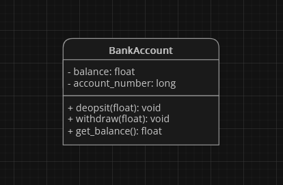
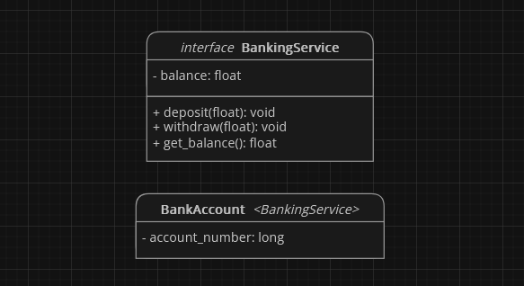

# Dependency Inversion Principle (DIP)

Zasada **dependency inversion principle** czyli po polsku **zasada odwrócenia zależności** lub w skrócie **DIP**, to piąta i ostatnia zasada [**SOLID**](index.html). Mówi ona, że **wysokopoziomowe moduły nie powinny zależeć od modułów niskiego poziomu, oba powinny zależeć od abstrakcji**.

> "High-level modules should not import anything from low-level modules, both should depend on abstractions." - [Robert Cecil Martin](https://en.wikipedia.org/wiki/Robert_C._Martin)

## Zalety
**DIP** ma kilka zalet:
- **upraszcza testowanie kodu** - gdy moduły zależą od abstrakcji, można je testować niezależnie od ich implementacji.
- **ułatwia rozszerzanie kodu** - gdy moduły zależą od abstrakcji, można łatwo dodać nowe moduły bez konieczności modyfikowania istniejących modułów.
- **łatwiejsze utrzymanie kodu oraz mniejsze ryzyko popełnienia błędu** - gdy moduły zależą od abstrakcji, zmiany w implementacji jednego modułu nie wpływają na inne moduły.

## Metody Stosowania
Oto kilka wskazówek, jak stosować zasadę **DIP**:
- **używaj interfejsów** - interfejsy to abstrakcje, które definiują kontrakt, który muszą spełniać moduły.
- **używaj zależności konstruktora** - zależności konstruktora to sposób na zapewnienie, że moduły zależą od abstrakcji, a nie od konkretnych implementacji.

## Przykład Zastosowania
Załóżmy, że mamy klasę `BankAccount` reprezentującą rachunek bankowy. Klasa ta posiada następujące pola i metody:

Klasa ta implementuje metody do wykonywania podstawowych operacji na rachunku bankowym, takich jak wpłata, wypłata oraz sprawdzenie salda.

    Ta implementacja <b>narusza zasadę DIP</b>, ponieważ klasa <code>BankAccount</code> nie zależy od abstrakcji.

Aby naprawić to naruszenie klasa `BankAccount` powinna być zaprojektowana w taki sposób, aby mogła współpracować z różnymi systemami bankowymi. Aby to osiągnąć możemy **utworzyć** interfejs `BankingService`, który będzie definiował metody, które są potrzebne do wykonywania operacji na rachunkach bankowych. Klasa `BankAccount` będzie implementować interfejs `BankingService`:

## Podsumowanie
Zasada **DIP** to ważna zasada programowania obiektowego, która pomaga w tworzeniu **łatwiejszego w utrzymaniu** oraz posiadającego **mniejsze prawdopodobieństwo popełnienia błędu** kodu. Zastosowanie jej sprawi, że istnieje mniejsza szansa, że popełnimy błąd oraz roszerzanie i testowanie kodu **będą prostszymi zadaniami**.
