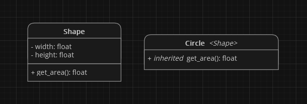
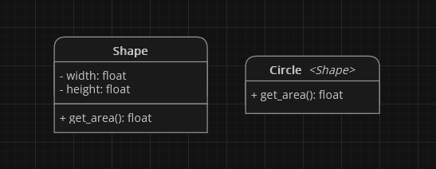

# Liskov Substitution Principle (LSP)


Zasada **Liskov substitution principle** czyli po polsku **zasada podstawienia Liskov** lub w skrócie **LSP**, to trzecia zasada [**SOLID**](index.html). Wymyślona przez amerykańską informatyczkę [Barbarę Liskov](https://en.wikipedia.org/wiki/Barbara_Liskov) w roku 1987. Mówi ona, że **jeśli S jest podtypem T, to obiekty typu S mogą być używane wszędzie tam, gdzie oczekiwane są obiekty typu T**.

<br /><br /><br />

> "If S subtypes T, what holds for T-objects holds for S-objects." - [Barbara Liskov](https://en.wikipedia.org/wiki/Barbara_Liskov)

## Zalety
**LSP** ma kilka zalet:
- **większa użyteczność klas** - gdy podtyp zachowuje się w taki sam sposób jak typ bazowy, można go używać w miejscu typu bazowego, bez konieczności modyfikowania kodu.
- **ułatwia utrzymanie kodu** - gdy podtyp zachowuje się w taki sam sposób jak typ bazowy, zmiany w typie bazowym nie wpływają na podtyp.

## Metody Stosowania
Oto kilka wskazówek, jak stosować zasadę **LSP**:
- **przy tworzeniu podtypów, należy zachować zachowania typu bazowego** - podtyp powinien być w stanie wykonać wszystkie operacje, które może wykonać typ bazowy, w taki sam sposób jak typ bazowy.
- **należy unikać nadpisywania metod typu bazowego** - nadpisanie metody typu bazowego może spowodować, że podtyp nie będzie zachowywał się w taki sam sposób jak typ bazowy.
- **należy unikać dodawania nowych ograniczeń do podtypów** - dodanie nowego ograniczenia do podtypu może spowodować, że podtyp nie będzie mógł być używany w miejscu typu bazowego.

## Przykład Zastosowania
Załóżmy, że mamy klasę `Shape` reprezentującą kształt oraz `Circle` dziedziczącą po `Shape`. Klasy te posiadają następujące pola i metody:



```python
def get_area(self):
    return self.width * self.height
```

Klasa `Shape` implementuje metodę `get_area()`, która oblicza pole powierzchni kształtu.

<div class="warning">
    Klasa <code>Circle</code> dziedziczy po klasie <code>Shape</code>, więc posiada również metodę <code>get_area()</code>, która oblicza pole powierzchni w taki sam sposób jak zaimplementowano to w klasie <code>Shape</code>.
    <br /><br />
    <b>Narusza to zasadę LSP</b>, ponieważ metoda <code>get_area()</code> liczy pole powierzchni dla prostokąta, co powoduje że metoda <code>get_area()</code> w klasie <code>Circle</code> także będzie liczyć pole powierzchni dla prostokąta zamiast koła.
</div>

Aby naprawić to naruszenie, możemy **zmodyfikować** klasę `Circle` i **zastąpić** metodę `get_area()` własną implementacją.



W tym przypadku klasa `Circle` jest pełnoprawnym podtypem klasy `Shape` i **zachowuje spójność zachowań oraz prawidłowo oblicza pole powierzchni koła**.

## Podsumowanie
Zasada **LSP** to kolejna ważna zasada programowania obiektowego, która **pomaga w tworzeniu łatwiejszego do utrzymania i łatwiej rozszerzalnego kodu**. Stosowanie jej sprawi, że **utrzymywanie naszego kodu w przyszłości będzie prostsze**.
