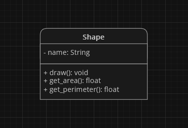
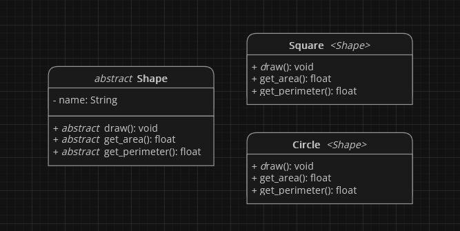

# Open-Closed Principle (OCP)

Zasada **open-closed principle** czyli po polsku **zasada otwarte-zamknięte** lub w skrócie **OCP**, to druga zasada [**SOLID**](index.html). Mówi ona, że każdy element kodu (klasa, metoda, itd.) powinien być **otwarty na rozszerzenie**, ale **zamknięty na modyfikację**.

    

> "Software entities should be open for extension, but closed for modification." - [Bertrand Meyer](https://en.wikipedia.org/wiki/Bertrand_Meyer)

## Zalety
**OCP** ma kilka zalet:
- **zwiększa rozszerzalność kodu** - gdy klasa jest otwarta na rozszerzenie, można dodać nowe funkcje lub zadania bez naruszania istniejącego kodu.
- **ułatwia utrzymanie kodu i zapobiega występywaniu błędów** - gdy klasa jest zamknięta na modyfikację, zmiany są ograniczone do nowych rozszerzeń, co ułatwia utrzymanie kodu i zapobiega błędom.
- **upraszcza etap testowania kodu** - gdy klasa jest otwarta na rozszerzenie, można napisać testy dla nowych rozszerzeń, co pomaga zapewnić ich poprawne działanie.

## Metody Stosowania
Oto kilka wskazówek, jak stosować zasadę **OCP**:
- **używaj dziedziczenia** - dziedziczenie pozwala na dodanie nowych funkcji lub zadań do istniejącej klasy bez modyfikowania tej klasy.
- **używaj interfejsów** - interfejsy pozwalają na dodanie nowych funkcji lub zadań do istniejącej klasy bez modyfikowania jej.
- **używaj abstrakcji** - abstrakcja pozwala na ukrycie szczegółów implementacji, co ułatwia rozszerzanie kodu.

## Przykład Zastosowania
Załóżmy, że mamy klasę `Shape` reprezentującą kształt. Klasa ta posiada następujące pola i metody:

Klasa ta implementuje metody do rysowania, obliczania pola powierzchni i obwodu różnych kształtów.

    Jeśli chcemy dodać nowy kształt, np. koło lub kwadrat, musimy zmodyfikować klasę <code>Shape</code>. Możemy to zrobić, dodając do klasy nowe metody do rysowania kwadratu, obliczania jego pola powierzchni i obwodu.
      
    To <b>naruszenie zasady OCP</b>, ponieważ wymaga modyfikacji istniejącego kodu.

Aby naprawić to naruszenie, możemy **uczynić klasę** `Shape` **abstrakcyjną**, będzie ona reprezentować abstrakcyjny kształt. Klasa ta będzie definiować metody abstrakcyjne do rysowania, obliczania pola powierzchni i obwodu kształtu.

Konkretne klasy kształtów, takie jak `Circle` czy `Square`, będą **dziedziczyć** po klasie `Shape` i **implementować** metody abstrakcyjne.

W tym przypadku, aby dodać nowy kształt, wystarczy utworzyć nową klasę **dziedziczącą** po klasie `Shape` i **zaimplementować** metody abstrakcyjne. **Nie musimy modyfikować istniejącego kodu.**

## Podsumowanie
Zasada **OCP** to również ważna zasada programowania obiektowego, która **pomaga w tworzeniu łatwiej rozszerzalnego kodu, w którym będzie mniejsze prawdopodobieństwo wystąpienia problemów**. Stosowanie jej sprawi, że **późniejsze wzbogacanie o nowe funkcje i testowanie naszego kodu będzie dużo prostsze**.
