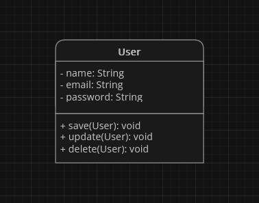
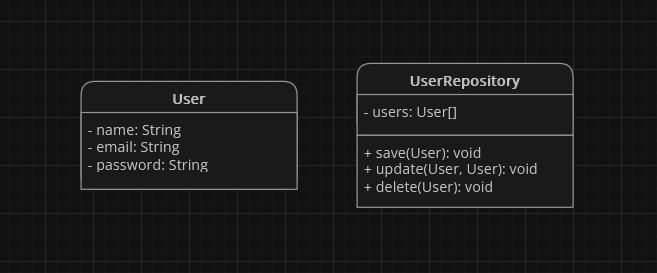

# Single-Responsibility Principle (SRP)

Zasada **single-responsibility principle** czyli po polsku **zasada jednej odpowiedzialności** lub w skrócie **SRP**, to pierwsza z zasad [**SOLID**](index.html). Mówi ona, że każda **klasa powinna mieć tylko jedną odpowiedzialność**, czyli **powinna być odpowiedzialna tylko za jedną funkcję lub zadanie**.

> "A module should be responsible to one, and only one, actor." - [Robert Cecil Martin](https://en.wikipedia.org/wiki/Robert_C._Martin)

## Zalety
**SRP** ma kilka zalet:
- **ułatwia zrozumienie kodu** - gdy klasa jest odpowiedzialna za tylko jedną rzecz, jest łatwiej zrozumieć, co robi i jak działa.
- **upraszcza testowanie kodu** - gdy klasa ma tylko jedną odpowiedzialność, łatwiej jest napisać testy, które sprawdzają, czy działa poprawnie.
- **sprawia, że kod jest łatwiej rozszerzalny** - gdy klasa ma tylko jedną odpowiedzialność, łatwiej jest dodać nowe funkcje lub zadania bez naruszania istniejącego kodu.

## Metody Stosowania
Oto kilka wskazówek, jak stosować zasadę **SRP**:
- **rozważ, jakie są obowiązki klasy** - czy klasa ma tylko jedną odpowiedzialność?
- **zastanów się, czy klasa potrzebuje więcej niż jednej odpowiedzialności** - czy można podzielić ją na dwie różne klasy?

## Przykład Zastosowania
Załóżmy, że mamy klasę `User` reprezentującą użytkownika systemu. Klasa ta posiada następujące pola oraz metody:

    Klasa ta <b>narusza zasadę SRP</b>, ponieważ ma więcej niż jedną odpowiedzialność. Klasa ta odpowiada za reprezentowanie użytkownika, ale również za zapisywanie, aktualizowanie i usuwanie użytkowników z bazy danych.

Aby naprawić to naruszenie, możemy **podzielić** klasę `User` na dwie klasy:

Klasa `User` nadal odpowiada za reprezentowanie użytkownika, natomiast klasa `UserRepository` odpowiada za dostęp do bazy danych i wykonywanie operacji na użytkownikach. W ten sposób każda klasa **posiada jedną odpowiedzialność**.

## Podsumowanie
Zasada **SRP** to ważna zasada programowania obiektowego, która **pomaga w tworzeniu bardziej czytelnego, testowalnego i rozszerzalnego kodu**. Stosowanie jej sprawi, że **praca z naszym kodem w przyszłości będzie dużo prostsza i przyjemniejsza**.
